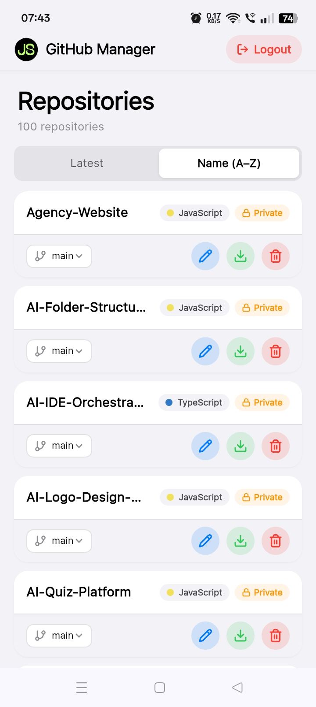
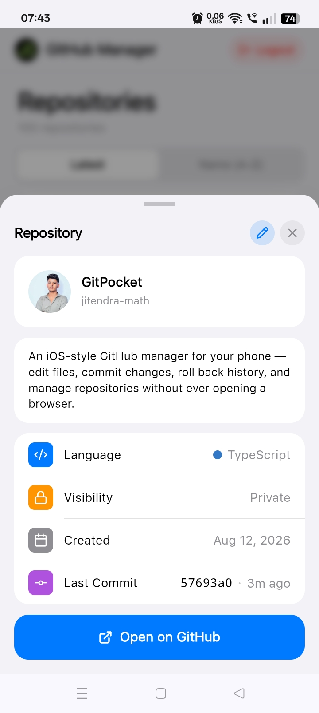
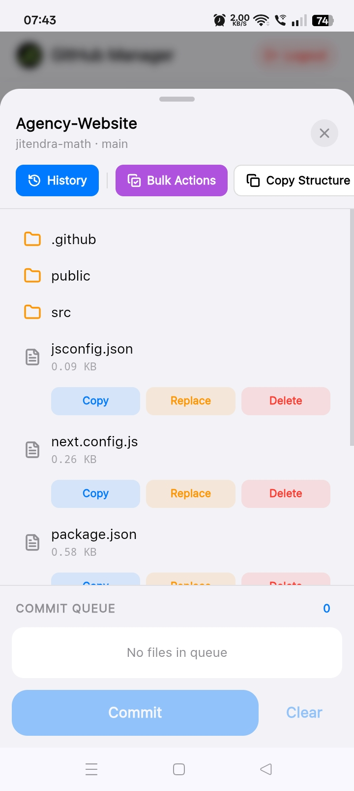
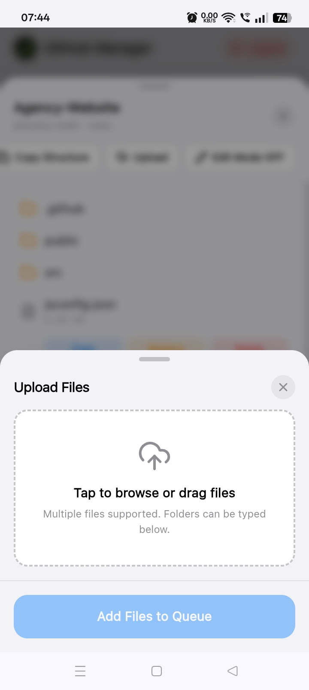

<div align="center">


# GitH Mobile

**An iOS-style GitHub manager for your phone.**

Edit files, commit changes, roll back history, and manage repositories — without ever opening a browser.

[](https://opensource.org/licenses/MIT)
[](https://nextjs.org)
[](https://www.typescriptlang.org)
[](#-install-as-an-app)

[**🌐 Live Demo**](https://github.jssoriginals.com) · [**🐛 Report Bug**](https://github.com/jitendra-math/GitH-Mobile/issues) · [**✨ Request Feature**](https://github.com/jitendra-math/GitH-Mobile/issues)

</div>

---

## 📸 Screenshots

<div align="center">

| Dashboard | Repo Info | Edit Files | Upload Files |
|:---:|:---:|:---:|:---:|
|  |  |  |  |

</div>

---

## ✨ Features

### 🎨 iOS-Native Design
- **Apple-style UI** — bottom sheets, grabbers, spring animations, frosted glass
- **iOS system colors** — Blue, Green, Red, Orange, Purple — exactly like Apple's HIG
- **SF Pro font** — the same font Apple uses
- **Safe area support** — perfect on notched devices

### 📁 Repository Management
- Browse all your repositories in a clean iOS list
- Sort by **Latest** or **Name (A–Z)** with iOS segmented control
- View detailed repo info — language, visibility, created date, last commit
- **Edit repo metadata** — rename, update description, change visibility

### 📝 File Editor
- **Full code editor** with syntax highlighting (CodeMirror + VS Code theme)
- **Copy** file content to clipboard
- **Replace** file content from clipboard
- **Download** binary files (images, PDFs, archives)
- **Delete** files (with type-to-confirm safety)

### 🚀 Bulk Operations
- **Bulk Create** — add multiple files at once by path
- **Bulk Copy** — fetch multiple file contents to clipboard
- **Terminal** — run `mkdir` and `mv` commands with a real terminal feel

### 📦 Upload Files
- Drag & drop or tap to browse
- Multiple files supported
- Rename files before committing

### 🕐 Commit & History
- **Commit queue** with diff preview
- **Commit history** with one-tap rollback
- Type-to-confirm safety for destructive actions

### 📱 PWA Ready
- **Install as a native app** on Android
- **Offline-ready** with service worker caching
- **Auto-updating** — no app store needed

---

## 🛠️ Tech Stack

| Layer | Tech |
|---|---|
| **Framework** | [Next.js 14](https://nextjs.org) (App Router) |
| **Language** | [TypeScript](https://www.typescriptlang.org) |
| **Styling** | [Tailwind CSS](https://tailwindcss.com) |
| **Animation** | [Framer Motion](https://www.framer.com/motion/) |
| **State** | [Zustand](https://zustand-demo.pmnd.rs/) |
| **Code Editor** | [CodeMirror](https://codemirror.net/) |
| **Icons** | [Lucide](https://lucide.dev/) |
| **API** | [GitHub REST API v3](https://docs.github.com/en/rest) |
| **PWA** | [next-pwa](https://github.com/DuCanhGH/next-pwa) |
| **Deploy** | [Vercel](https://vercel.com) |

---

## 🚀 Getting Started

### Prerequisites

- **Node.js** 18.17 or later
- A **GitHub Personal Access Token (Classic)** with `repo` scope
  - [Create one here →](https://github.com/settings/tokens/new?scopes=repo&description=GitH%20Mobile)

### Installation

```bash
git clone https://github.com/jitendra-math/GitH-Mobile.git
cd GitH-Mobile
npm install
npm run dev
```

Open http://localhost:3000 in your browser.

Build for Production

```bash
npm run build
npm start
```

---

📱 Install as an App

GitH Mobile is a Progressive Web App (PWA). You can install it on your Android phone without visiting the Play Store.

Android (Chrome)

1. Open github.jssoriginals.com in Chrome
2. Tap the three-dot menu in the top-right
3. Tap "Add to Home screen" or "Install app"
4. Confirm — the app icon will appear on your home screen
5. Launch it like any native app — fullscreen, no browser UI

Desktop (Chrome / Edge)

1. Open the site
2. Look for the install icon in the address bar
3. Click Install

---

🔐 Security & Privacy

· Your token never leaves your device. It's stored in an httpOnly, secure, sameSite=lax cookie that only your browser can access.
· No backend. All API calls go directly to GitHub from your browser.
· No analytics, no tracking. Nothing is logged.
· 30-day session. Token expires automatically after 30 days.

⚠️ Never share your Personal Access Token. If you think it's compromised, revoke it immediately at github.com/settings/tokens.

---

📂 Project Structure

```
GitH-Mobile/
├── actions/
│   └── github.ts              # Server actions (GitHub API calls)
├── app/
│   ├── dashboard/
│   │   ├── layout.tsx         # Dashboard wrapper (Navbar + EditModal)
│   │   └── page.tsx           # Repo list page
│   ├── fonts/
│   │   └── SFUIText-Regular.woff2
│   ├── globals.css            # iOS design tokens
│   ├── layout.tsx             # Root layout
│   └── page.tsx               # Login page
├── components/
│   ├── AlertModal.tsx         # iOS alert dialog
│   ├── BulkActionModal.tsx    # Bulk create/copy
│   ├── CodeEditorModal.tsx    # CodeMirror editor
│   ├── ConfirmModal.tsx       # iOS confirm dialog
│   ├── DangerConfirmModal.tsx # Type-to-confirm dialog
│   ├── EditModal.tsx          # Main repo editor sheet
│   ├── FileUploadModal.tsx    # File upload sheet
│   ├── IOSToggle.tsx          # iOS-style switch
│   ├── LoginModal.tsx         # Login bottom sheet
│   ├── Navbar.tsx             # Top navigation
│   ├── RenameFileModal.tsx    # Rename file dialog
│   ├── RepoCard.tsx           # Repository card
│   ├── RepoInfoModal.tsx      # Repo details sheet
│   ├── RepoList.tsx           # Repo list + sort
│   ├── RepoSettingsModal.tsx  # Repo settings sheet
│   ├── TerminalModal.tsx      # Terminal (mkdir/mv)
│   ├── TokenForm.tsx          # PAT input form
│   └── TreeNode.tsx           # File tree node
├── lib/
│   └── utils.ts               # Helpers (base64, tree utils)
├── public/
│   ├── .well-known/
│   │   └── assetlinks.json    # TWA verification
│   ├── fonts/
│   ├── screenshots/           # App screenshots
│   ├── logo-192.png
│   ├── logo-512.png
│   └── manifest.json          # PWA manifest
├── store/
│   └── useEditStore.ts        # Zustand store
├── next.config.js             # Next + PWA config
├── package.json
├── tailwind.config.ts
└── tsconfig.json
```

---

🗺️ Roadmap

☑ iOS-style UI foundation
☑ Repository list & info
☑ File editor with syntax highlighting
☑ Commit queue & multi-file commits
☑ Commit history & rollback
☑ Bulk actions
☑ File upload
☑ Terminal (mkdir, mv)
☑ Repo settings (rename, description, visibility)
☑ PWA manifest & service worker
☐ Review pending files before commit
☐ Dark mode
☐ Push notifications for commits
☐ Play Store release (TWA)
☐ File search & filter
☐ Multi-repo operations

---

🤝 Contributing

Contributions are welcome! If you have an idea, bug report, or improvement:

1. Fork the repository
2. Create a branch (git checkout -b feature/amazing-feature)
3. Commit your changes (git commit -m 'Add amazing feature')
4. Push to the branch (git push origin feature/amazing-feature)
5. Open a Pull Request

For bugs or feature requests, please open an issue.

---

📄 License

Distributed under the MIT License. See LICENSE for more information.

You're free to use, modify, and distribute this project — just keep the copyright notice.

---

👤 Author

Jitendra Singh

· GitHub: @jitendra-math
· Project: GitH Mobile
· Live: github.jssoriginals.com

---

🙏 Acknowledgments

· GitHub REST API — the entire backbone of this app
· Next.js team — for an incredible framework
· Vercel — for free, fast hosting
· Apple Human Interface Guidelines — for the design inspiration
· Lucide — for the beautiful icons
· Everyone who's contributed ideas, feedback, and bug reports ❤️

---

<div align="center">

If you find this project useful, please consider giving it a ⭐️

Made with ❤️ in India 🇮🇳

</div>